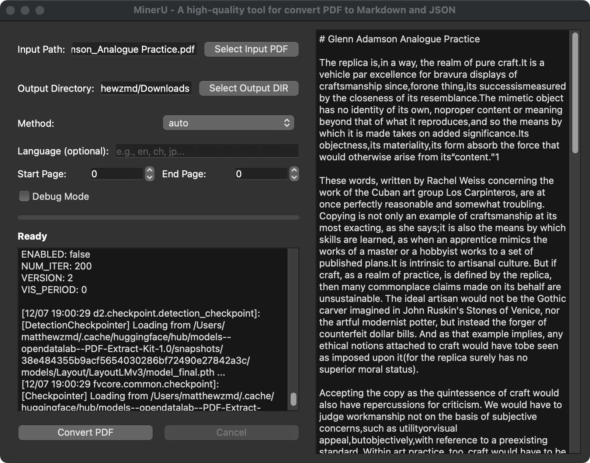

English | [简体中文](./README.zh-CN.md)

<p align="center">
  
  <br>MinerU-GUI, a simple MinerU frontend.
</p>


# Miner-GUI

A simple [MinerU](https://github.com/opendatalab/MinerU) frontend.

## Installation

1. Follow the instructions in the MinerU documentation to install MinerU: https://mineru.readthedocs.io/en/latest/user_guide/install/install.html
2. Assumes you've installed [Anaconda](https://docs.anaconda.com/anaconda/install/), run inside Terminal
   ```bash
     conda create -n MinerU python=3.10
     conda activate MinerU
     python3 -m pip install -r requirements.txt
     # Download model weight files if you haven't already
     wget https://github.com/opendatalab/MinerU/raw/master/scripts/download_models_hf.py -O download_models_hf.py
     python3 download_models_hf.py
   ```
4. Start the program
   ```bash
     conda activate MinerU # Runs this if you haven't already
     ./main.py #or
     python3 ./main.py
   ```
